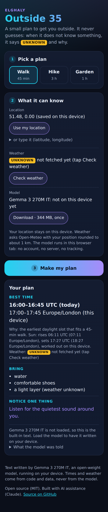

# Outside 35

**A small plan to get you outside. It never guesses.**
By elghaly. Built for the DEV Hacktoberfest Open-Source AI Challenge, Week 1: Touch Grass.

**Try it:** https://alarm2024.github.io/outside-35/ (phone first; works in any modern browser)



*Screenshot from the automated browser test: location typed in, weather not fetched (so it says UNKNOWN), model not loaded (so the built-in text is shown).*

## What it does

1. Pick a plan: **Walk** (45 min), **Hike** (3 h) or **Garden** (1 h).
2. Optionally share or type your location, check the weather, and download the model.
3. Tap **Make my plan**. You get:
   - **Best time:** a window shown in UTC and in your device's time zone, with the reason it was picked.
   - **Bring:** a short list.
   - **Notice one thing:** a bird, a tree, the sky.

### The rule: UNKNOWN, never a guess

If the app does not have the data, it says so: <code>UNKNOWN</code> plus the reason. It never fills a gap with a made-up number.

- No location → the time window is UNKNOWN ("location not shared yet").
- No weather → the window is based on daylight only, and the weather line says UNKNOWN and why (not fetched, no signal, or older than 3 h).
- A field missing from the forecast → that field is UNKNOWN, not zero.
- Polar night → it says the sun stays down, not "go at noon".

## How it works

| Part | Who does it | How |
|---|---|---|
| Sunrise and sunset | Code, on your device | The standard solar equations (the ones SunCalc uses). Tested against published Greenwich almanac times. |
| Weather | [Open-Meteo](https://open-meteo.com), only when you tap **Check weather** | Free, no account, no API key. Your position is rounded to two decimals (about 1 km) before it is sent. |
| Best time window | Code | The daylight slot with the lowest rain chance and the most comfortable temperature, wind and UV. With no weather, it is the earliest daylight slot that fits. Ends at least 15 min before sunset. |
| What you must bring | Code | Chosen from the data, each with its reason: "a rain jacket (rain likely)", "sunscreen (strong sun)". With no weather: "a light layer (weather unknown)". |
| The rest of "Bring", and "Notice" | **Gemma 3 270M IT**, in your browser | The model gets words, not numbers ("cool, dry, breezy, autumn, morning"). It picks three things from a fixed list for your plan and writes one sentence about something to notice. |
| The never-guess check | Code | Anything the model picks that is not on the list is left out. The whole answer is thrown away if it has any digit or link, picks fewer than two things from the list, or uses a weather word the data does not support ("breeze" on a calm day, anything about rain, sun or wind when there is no forecast, cloud cover ever). The app then shows its built-in text and tells you why. |

The model writes the friendly words. Code works out every number. That split is what lets a 270M-parameter model sit in a "never guess" app.

### The model

- **Gemma 3 270M IT** (open weights from Google), ONNX build [`onnx-community/gemma-3-270m-it-ONNX`](https://huggingface.co/onnx-community/gemma-3-270m-it-ONNX), `q4` quantisation.
- **Download:** about 344 MB, once (323 MB weights, 20 MB tokenizer, small config files). After that it loads from your browser's cache.
- **Runs with** [Transformers.js](https://github.com/huggingface/transformers.js) 4.3.1 on WebGPU when your browser has it, otherwise on the CPU with WebAssembly. ONNX Runtime's WASM files are served from this site, not a CDN.
- **Two runtime builds, on purpose.** The q4 file uses a quantized operator (`GatherBlockQuantized`) that ONNX Runtime's WebGPU-capable build runs only on the GPU. So WebGPU devices use that build, and every other device uses the plain build, which runs it on the CPU. If WebGPU fails on a device, the app remembers that and reloads once onto the CPU, with no second download. `npm run probe-ort` checks both builds against tiny graphs holding the same operators.
- **No server inference, no closed-model API, no account.** The page makes only two kinds of outside requests, and only when you tap for them: the model files from Hugging Face (**Download**), and the forecast for your rounded position from Open-Meteo (**Check weather**).
- **License:** the code here is MIT. Gemma's weights are under the [Gemma Terms of Use](https://ai.google.dev/gemma/terms); they are downloaded from Hugging Face, not stored in this repo.

### Offline

It is a PWA. After the first visit, the app works with no signal. The model works offline once you have downloaded it. Weather is then UNKNOWN ("no signal"), and the window falls back to daylight only.

## What is tested

- `npm test`: 33 unit tests. Sun times (Greenwich solstices within 3 min of the almanac, polar day and night), window picking, the never-guess check (including real weak answers from an earlier model run), weather parsing and staleness, and "the prompt has no numbers".
- `npm run smoke`: headless Chromium against the built site. UNKNOWN states, UTC and local times, a weather fixture, offline reload via the service worker, and that without the model download the page contacts nobody except Open-Meteo, and only when asked.
- `npm run probe-ort`: the shipped ONNX Runtime builds against the model's quantized operators, on the CPU and on WebGPU (SwiftShader, a software GPU, so no graphics card is needed).
- **Model check** (GitHub Actions, `model-check.yml`): loads the real Gemma 3 270M IT (q4) with the app's own prompt builder and never-guess check, and writes each answer to the job summary, used or discarded. It does this in Node, then in headless Chromium on the CPU and on WebGPU, each time making a plan, reloading with no signal, loading the model again from the browser cache and making another plan.
- **Not tested automatically:** real phones and real GPUs. The WebGPU run uses a software GPU.

## Run it yourself

```bash
npm ci --ignore-scripts   # browser build needs no native binaries
npm test
npm run build             # writes dist/
npx serve dist            # or any static server, then open the URL it prints
```

Deploys to GitHub Pages from `main` via `.github/workflows/pages.yml` (test → build → browser smoke test → deploy).

## Privacy

No account, no cookies, no analytics, no tracking. Outside requests happen only when you tap for them: the model download from Hugging Face, and the weather from Open-Meteo. Your plan choice, rounded location and last forecast are kept in this browser's local storage, so the app can work offline. Clear the site's data to remove them.

## Credits

Built with AI assistance (Claude). Sun formulas from Astronomy Answers (aa.quae.nl). Weather by Open-Meteo. Model by Google (Gemma), ONNX conversion by onnx-community.

MIT © elghaly
